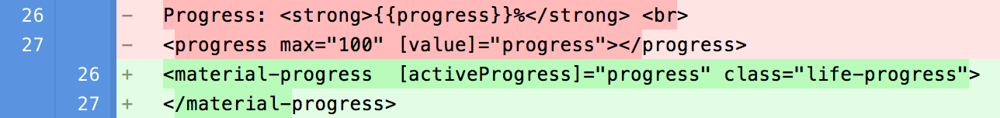

```
PENDING: fix description, snippet_img, css
```

In this step, you’ll change the app to use a few of the AngularDart Components:


*   \<material-progress>
*   \<glyph>
*   \<acx-scorecard>


## <i class="fa fa-money"> </i> Copy the source code

Make a copy of the base app's source code:


cd <repo-name>
cp -r 1-base myapp
cd myapp
pub get


From now on, you'll work in this copy of the source code,
using whatever [Dart web development tools](/tools) you prefer.


## <i class="fa fa-money"> </i> Add angular2_components to pubspec.yaml

Edit **pubspec.yaml** to add a dependency to **angular2_components**:


dependencies:
  angular2: 2.0.0-beta.22
  [[highlight]]angular2_components:[[/highlight]]
    [[highlight]]path: ../../acx[[/highlight]]
  browser: ^0.10.0
  dart_to_js_script_rewriter: ^1.0.1
  intl: ^0.14.0


```
[PENDING: fix path once we've published]
```

## <i class="fa fa-money"> </i> Set up the root component’s Dart file

Edit **lib/lottery_simulator.dart**, importing the Angular components and informing Angular about materialDirectives and materialBindings:


import 'package:angular2/core.dart';
[[highlight]]import 'package:angular2_components/angular2_components.dart';[[/highlight]]
...
@Component(
  selector: 'lottery-simulator',
  styleUrls: const ['lottery_simulator.css'],
  templateUrl: 'lottery_simulator.html',
  directives: const [
    [[highlight]]materialDirectives,[[/highlight]]
    ...
  ],
  providers: const [[[highlight]]materialBindings[[/highlight]], Settings],
)


Now you’re ready to use the components.

## <i class="fa fa-money"> </i> Use \<material-progress>

Edit the template file **lib/lottery_simulator.html** to use the \<material-progress> tag. The diffs should look similar to this:

 -> <material-progress...>">

```
PENDING: say something about the class and [activeProgress].
```

Run the app, and you’ll see the new progress bar stretching across the window:


<p style="color: red; font-weight: bold">>>>> inline image link here (to images/AngularDart_Components1.png). Store image on your image server and adjust path/filename if necessary.\</p>

As a reminder, here’s what the progress section looked like before:


<p style="color: red; font-weight: bold">>>>> inline image link here (to images/AngularDart_Components2.png). Store image on your image server and adjust path/filename if necessary.\</p>

That change is barely noticeable. Let’s make a bigger difference by adding images to the buttons, using the \<glyph> component.

## <i class="fa fa-money"> </i> Use \<glyph> in buttons

Using \<glyph> is similar to using \<material-progress>,
except that you also need
[material icon fonts](http://google.github.io/material-design-icons/).
You can find icons and instructions for including them at
[design.google.com/icons](https://design.google.com/icons).
Let’s use the following icons in the main simulator UI:


|---------------------+-----------------------+-----------------------|
| Current button text | New icon              | Icon name             |
|---------------------|-----------------------|-----------------------|
| Play                | [TODO: add icon here] | play arrow            |
| Step                | [TODO: add icon here] | skip next            |
| Pause                | [TODO: add icon here] | pause            |
| Reset                | [TODO: add icon here] | replay            |
{:.table .table-striped}

<ol>

<li>
Find the icon font values for each of the icons. For example:
<ol style="list-style-type: lower-alpha">
  <li>
  Go to <a href="https://design.google.com/icons">design.google.com/icons</a>. </li>
  <li>
  Enter <b>play arrow</b> in the site search box. </li>
  <li>
  In the results, click the matching icon to get more information. </li>
  <li>
  Click <b>ICON FONT</b> to get the icon code to use: <b>play_arrow</b>. </li></ol></li>

<li>
  Edit the main HTML file (<b>web/index.html</b>) to add the following code to the &lt;head> section: 


<link rel="stylesheet" type="text/css"
    href="https://fonts.googleapis.com/icon?family=Material+Icons+Extended">

</li>

<li>
  Edit <b>lib/lottery_simulator.html</b> to
  change the buttons to use &lt;glyph> instead of text.
  Set the value of the <b>icon</b> attribute to the icon code,
  and put the text from the button in the <b>aria-label</b> attribute.
  For example:

  <p style="color: red; font-weight: bold">>>>> inline image link here (to images/AngularDart_Components3.png). Store image on your image server and adjust path/filename if necessary.\</p>

  <em>Alt text: id="play-button">Play -> id="play-button" aria-label="Play">\<glyph icon="play_arrow">\</glyph></em></li></ol>

That small amount of code makes a big difference in the UI:


<p style="color: red; font-weight: bold">>>>> inline image link here (to images/AngularDart_Components4.png). Store image on your image server and adjust path/filename if necessary.\</p>

## <i class="fa fa-money"> </i> Use \<glyph> in other components

If you scroll down to the Tips section of the page, you’ll see blank spaces where there should be icons:

 

<p style="color: red; font-weight: bold">>>>> inline image link here (to images/AngularDart_Components5.png). Store image on your image server and adjust path/filename if necessary.\</p>

The HTML template (lib/help/help.html) uses \<glyph> already, so why isn’t it working?

<aside class="alert alert-success" markdown="1">
<i class="fa fa-lightbulb-o"> </i> **Common problem: Forgetting to register a component** <br>
If an Angular component’s template uses a second Angular component without declaring it, that **second component doesn’t appear in the first component’s UI**. The solution: In the first component’s Dart file, **import** the second component and **register** the second component’s class as a directive.
</aside>

Edit **lib/help/help.dart** to import the AngularDart Components and register materialDirectives.



...
[[highlight]]import 'package:angular2_components/angular2_components.dart';[[/highlight]]

@Component(
  ...
  directives: const [
    [[highlight]]materialDirectives,[[/highlight]]
    ...
  ],
  ...


<aside class="alert alert-info" markdown="1">
**Note:**
When you added AngularDart Components support to lib/lottery_simulator.dart, you also added materialBindings to the providers list. You don’t need to do that here, because the \<help-component> UI has no buttons or anything else that requires the animations defined in materialDirectives. You also don’t need to do anything to get the material icon fonts, since the app’s entry point (web/index.html) already imports the font file.
</aside>

Adding those two lines to lib/help/help.dart makes the glyphs display:


<p style="color: red; font-weight: bold">>>>> inline image link here (to images/AngularDart_Components6.png). Store image on your image server and adjust path/filename if necessary.\</p>


## <i class="fa fa-money"> </i> Use \<acx-scorecard>

Let’s make one more change: using scorecards (\<acx-scorecard>) to display the betting and investing results. Because \<acx-scorecard> isn’t included in materialDirectives, you need to explicitly register its Dart class, ScorecardComponent. We’ll use the scorecards in the app’s custom ScoresComponent (\<scores-component>), which is implemented in lib/scores/scores.*.


1.  Edit **lib/scores/score.dart** (the Dart file for ScoresComponent) to register ScorecardComponent and the materialBindings provider:

\<code>...
\<strong>import 'package:angular2_components/angular2_components.dart';\</strong>

@Component(
  ...
  \<strong>directives: const [ScorecardComponent],
  providers: const [materialBindings],\</strong>
)\</code>
1.  Edit \<strong>lib/scores/score.html\</strong> (the template file for ScoresComponent) to change each \<div> to \<acx-scorecard>. Specify the following attributes (documented in the ScorecardComponent API reference) for each \<acx-scoreboard>:
    *   \<strong>label:\</strong> Set this to the string in the div’s \<h4> heading.
    *   \<strong>class:\</strong> Set this to “betting” or “investing”, so that you can use it to specify custom styles.
    *   \<strong>value:\</strong> Set this to the value of the \<code>cash\</code> (for betting) or \<code>altCash\</code> (for investing) property of ScoresComponent.
    *   \<strong>description:\</strong> Set this to the second line of content in the div’s \<p> section.
    *   \<strong>changeType:\</strong> Specify this for betting only, since only betting can have a negative value. Set it to the value that [class] is set to, surrounded by \<code>{{ }}\</code>.

For example, here’s how to convert the “Betting” div:


<p style="color: red; font-weight: bold">>>>> inline image link here (to images/AngularDart_Components7.png). Store image on your image server and adjust path/filename if necessary.\</p>

1.  Edit **lib/scores/score.css** (styles for ScoresComponent) to specify that `.investing` floats to the right. You can also remove the unneeded `.positive` and `.negative` styles.

`.investing {
  float: right;
}`
1.  Refresh the app, and look at the nice new UI:

<p style="color: red; font-weight: bold">>>>> inline image link here (to images/AngularDart_Components8.png). Store image on your image server and adjust path/filename if necessary.\</p>

Remember, it used to look like this: 


<p style="color: red; font-weight: bold">>>>> inline image link here (to images/AngularDart_Components9.png). Store image on your image server and adjust path/filename if necessary.\</p>


### Common problem: registering the wrong component

It’s easy to accidentally register the wrong component. For example, you might register ScoresComponent instead of ScorecardComponent. **If the component doesn’t show up, make sure the containing component’s Dart file includes the right component.**

## 


