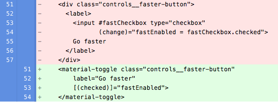
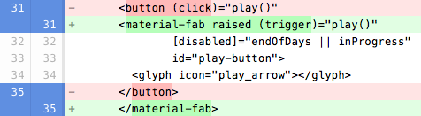
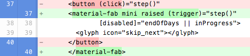
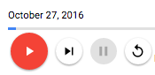
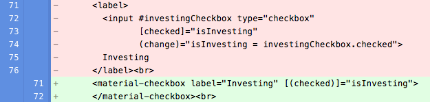
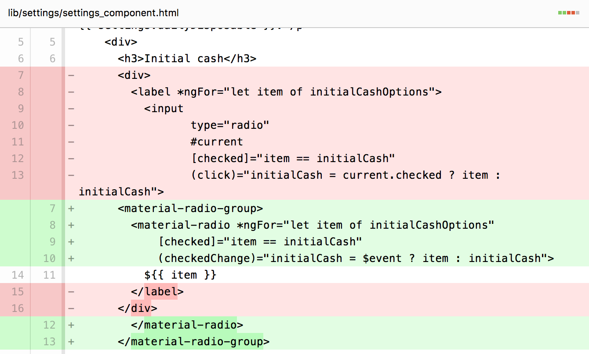
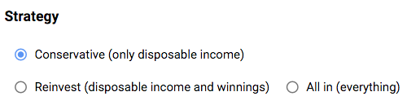

```
PENDING: fix description, snippet_img, css
```

## Step 3: Upgrade Buttons and Inputs

In this step you’ll change many of the controls in the app, using these components:


*   \<material-toggle>
*   \<material-fab>
*   \<material-checkbox>
*   \<material-radio> and \<material-radio-group>

These controls appear in two custom components: \<lottery-simulator> and \<settings-component>.

## Use \<material-toggle>

Edit **lib/lottery_simulator.html** to convert the “Go faster” \<div> (and its children) into a \<material-toggle>, as the following diff shows:

 into a <material-toggle>'>

Here’s the resulting UI:


The class behind \<material-toggle>, [MaterialToggle], defines **label** and **checked** attributes. The **label** attribute contains the main text for the toggle, which the app previously specified in the \<label> element. A two-way binding to the **checked** property simplifies setting the toggle’s state.

## Use \<material-fab>

Now convert the buttons that have icons into floating action buttons (FABs).

1.  Edit **lib/lottery_simulator.html**.
1.  Convert the Play button from a \<button> to a \<material-fab> ([MaterialFab]), adding the **raised** attribute and changing `(click)` to `(trigger)`:

 -> <material-fab> diffs'>

1.  Convert the remaining three buttons in the same way, but add the **mini** attribute. For example: 

 -> <material-fab> diffs'>

Once you’re done, run the app and play with the buttons. They look good, and they have a nice ripple animation when you click them.




### **Common pattern: (trigger)**

Many of the AngularDart Components support trigger events. As a rule, your app should 
**handle trigger events instead of click events**, because trigger is better for accessibility. For example, trigger events fire on both click and keypress, and trigger events don’t fire when the element is disabled.

## Use \<material-checkbox>

The primary UI is looking good! Now let’s start improving the settings section of the UI, which is implemented in lib/settings/settings_component.*. First, let’s change the checkbox to use material-checkbox.

1.  Edit the Dart file for \<settings-component> (**lib/settings/settings_component.dart**) to import angular2_components, and to register MaterialCheckboxComponent and materialBindings:

**\<code>import 'package:angular2_components/angular2_components.dart';
...
@Component(
  ...
  directives: const [
    MaterialCheckboxComponent,
    NgFor
  ],
  providers: const [materialBindings],
)\</code>\</strong>
1.  Edit the template file (\<strong>lib/settings/settings_component.html\</strong>), changing the “checkbox” input (and its surrounding label) into a \<material-checkbox>. 

<input> -> <material-checkbox> diffs'>

Look how much simpler that code is! [MaterialCheckbox] supports a \<strong>label\</strong> attribute and two-way binding to \<strong>checked\</strong>, enabling much cleaner HTML.

## Use \<material-radio> and \<material-radio-group>

Still working on the settings, let’s convert radio buttons into \<material-radio> components. Each group of radio buttons is contained by a \<material-radio-group>.

1.  Edit the Dart file for \<settings-component> (**lib/settings/settings_component.dart**) to register MaterialRadioComponent and MaterialRadioGroupComponent:

\<code>...
@Component(
  ...
  directives: const [
\<strong>    \</strong>MaterialCheckboxComponent,\<strong>
    MaterialRadioComponent,
    MaterialRadioGroupComponent,
\</strong>    NgFor
  ],
\<strong>  \</strong>...\<strong>
\</strong>)\</code>
1.  In the template file (\<strong>lib/settings/settings_component.html\</strong>), find the string \<code>"radio"\</code>. Change the enclosing label to \<material-radio>, and then the immediately enclosing div to \<material-radio-group>.
1.  Move the input’s \<code>[checked]\</code> and \<code>(click)\</code> code into the material-radio component. If the input has \<code>[disabled]\</code> code, move that too.
1.  Change \<code>(click)\</code> to \<code>(checkedChange)\</code>, and \<code>current.checked\</code> to \<code>$event\</code>.
Here’s why: [MaterialRadioComponent] fires checkedChange when the radio button’s selection state changes. The event’s value is true if the radio button has become selected, and otherwise false.
1.  Remove the \<input> tag. Your code changes should look like this:

<label><input> -> <material-radio-group><material-radio> diffs'>

1.  Repeat the process for the remaining radio button groups.
1.  Run the app. You might notice a small problem with the appearance of the Strategy settings:



1.  Fix the issue by editing\<strong> lib/settings/settings_component.html\</strong> to add a rule that maximizes that component’s width:

\<code>.betting-panel material-radio {
  width: 100%;
}\</code>

The app is now much better looking, but it still displays too much information. We’ll fix that in the next step.

**Note:** You might notice that the lib/settings/settings_component.html still has a few \<button> elements—all the Save and Cancel buttons. You’ll remove those in the next step.

## 

