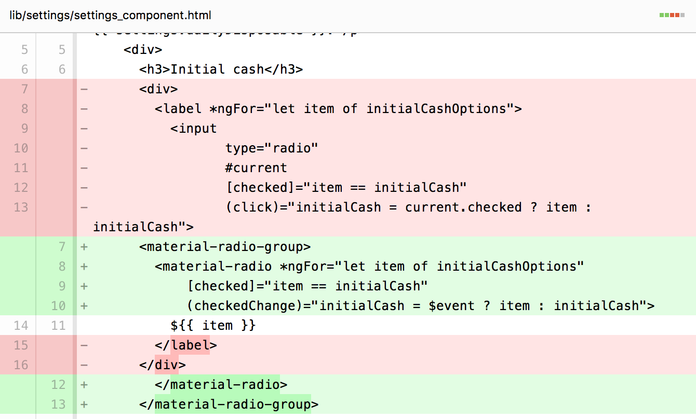

In this step you’ll change many of the controls in the app,
using these components:

*   \<material-toggle>
*   \<material-fab>
*   \<material-checkbox>
*   \<material-radio> and \<material-radio-group>

These controls appear in two custom components: \<lottery-simulator>
and \<settings-component>.

## <i class="fa fa-money"> </i> Use material-toggle

Edit **lib/lottery_simulator.html** to convert the “Go faster” \

(and its children) into a \<material-toggle>, as the following diff shows:

 into a <material-toggle>'>

Here’s the resulting UI:

The class behind \<material-toggle>,
[MaterialToggleComponent]({{site.acx_api}}/angular_components/MaterialToggleComponent-class.html),
defines **label** and **checked** attributes.
The **label** attribute contains the main text for the toggle,
which the app previously specified in the \<label> element.
A two-way binding to the **checked** property simplifies setting the
toggle’s state.

## <i class="fa fa-money"> </i> Use material-fab

Now convert the buttons that have icons into floating action buttons (FABs).

<ol markdown="1">

<li markdown="1"> Edit **lib/lottery_simulator.html**.
</li>

<li markdown="1"> Convert the Play button from a **\<button>** to a
    **\<material-fab>**
   ([MaterialFabComponent]({{site.acx_api}}/angular_components/MaterialFabComponent-class.html)),
    adding the **raised** attribute and
    changing **`(click)`** to **`(trigger)`**:

 -> <material-fab> diffs'>
</li>

<li markdown="1"> Convert the remaining three buttons in the same way,
    but add the **mini** attribute. For example:

 -> <material-fab> diffs'>
</li>
</ol>

Once you’re done, run the app and play with the buttons.
They look good, and they have a nice ripple animation when you click them.

<aside class="alert alert-success" markdown="1">
<i class="fa fa-exclamation-circle"> </i> **Common pattern: (trigger)**  

Many of the AngularDart Components support trigger events. As a rule,
your app should **handle trigger events instead of click events**,
because trigger is better for accessibility. For example,
trigger events fire on both click and keypress,
and trigger events don’t fire when the element is disabled.
</aside>

## <i class="fa fa-money"> </i> Use material-checkbox

The primary UI is looking good!
Now let’s start improving the settings section of the UI,
which is implemented in lib/src/settings/settings_component.* files.
First, let’s change the checkbox to use \<material-checkbox>.

<ol markdown="1">

<li markdown="1"> Edit the Dart file for \<settings-component>
    (**lib/src/settings/settings_component.dart**) to import angular_components,
    and to register
    [MaterialCheckboxComponent]({{site.acx_api}}/angular_components/MaterialCheckboxComponent-class.html)
    and `materialProviders`:


[[highlight]]import 'package:angular_components/angular_components.dart';[[/highlight]]
...
@Component(
  ...
  directives: const [
    [[highlight]]MaterialCheckboxComponent,[[/highlight]]
    NgFor
  ],
  [[highlight]]providers: const [materialProviders],[[/highlight]]
)

</li>

<li markdown="1"> Edit the template file
    (**lib/src/settings/settings_component.html**),
    changing the “checkbox” input (and its surrounding label)
    into a \<material-checkbox>.

<input> -> <material-checkbox> diffs'>
</li>
</ol>

Look how much simpler that code is!
MaterialCheckboxComponent supports a **label** attribute and
two-way binding to **checked**, enabling much cleaner HTML.

## <i class="fa fa-money"> </i> Use material-radio and material-radio-group

Still working on the settings, let’s convert radio buttons
into \<material-radio> components. Each group of radio buttons
is contained by a \<material-radio-group>.

<ol markdown="1">

<li markdown="1"> Edit the Dart file for \<settings-component>
    (**lib/src/settings/settings_component.dart**) to register
    [MaterialRadioComponent]({{site.acx_api}}/angular_components/MaterialRadioComponent-class.html) and
    [MaterialRadioGroupComponent]({{site.acx_api}}/angular_components/MaterialRadioGroupComponent-class.html):


...
@Component(
  ...
  directives: const [
    MaterialCheckboxComponent,
    [[highlight]]MaterialRadioComponent,[[/highlight]]
    [[highlight]]MaterialRadioGroupComponent,[[/highlight]]
    NgFor
  ],
  ...
)

</li>

<li markdown="1"> In the template file
    (**lib/src/settings/settings_component.html**),
    find the string `"radio"`. Change the enclosing label to
    **\<material-radio>**, and then the immediately enclosing **\
**
    to **\<material-radio-group>**.
</li>

<li markdown="1"> Move the input’s `[checked]` and `(click)`
    code into the material-radio component.
    If the input has `[disabled]` code, move that too.
</li>

<li markdown="1"> Change `(click)` to `(checkedChange)`,
    and `current.checked` to `$event`.
    Here’s why:
    [MaterialRadioComponent]({{site.acx_api}}/angular_components/MaterialRadioComponent-class.html)
    fires checkedChange when the radio button’s selection state changes.
    The event’s value is true if the radio button has become selected,
    and otherwise false.
</li>

<li markdown="1"> Remove the \<input> tag.
    Your code changes should look like this:

<label><input> -> <material-radio-group><material-radio> diffs'>
</li>

<li markdown="1"> Repeat the process for the remaining radio button groups.
</li>

<li markdown="1"> Run the app. You might notice a small problem with
    the appearance of the Strategy settings:

</li>

<li markdown="1"> Fix the appearance problem by editing
    **lib/src/settings/settings_component.css** to add a rule that
    maximizes that component’s width:


.betting-panel material-radio {
  width: 100%;
}


The app is now much better looking, but it still displays too much
information. We’ll fix that in the next step.

<aside class="alert alert-info" markdown="1">
**Note:** You might notice that the
lib/src/settings/settings_component.html still has a few \<button>
elements—all the Save and Cancel buttons.
You’ll remove those in the next step.
</aside>

### Problems?

Check your code against the solution
in the `3-usebuttons` directory.
