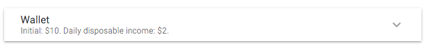
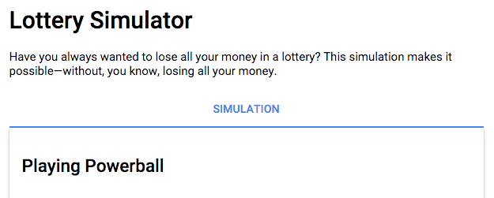

In this final step, you’ll use expansion panels and tabs to hide
information until the user needs it. You’ll use these components:

*   \<material-expansionpanel> and \<material-expansionpanel-set>
*   \<material-tab> and \<material-tab-panel>

## <i class="fa fa-money"> </i> Use material-expansionpanel and material-expansionpanel-set

Expansion panels are especially good for settings,
so let’s use them in the custom \<settings-component>,
implemented in lib/src/settings/settings_component.* files.

<ol markdown="1">

<li markdown="1"> Edit the Dart file
    (**lib/src/settings/settings_component.dart**),
    adding the expansion panel directives
    [MaterialExpansionPanel]({{site.acx_api}}/angular_components/MaterialExpansionPanel-class.html) and
    [MaterialExpansionPanelSet]({{site.acx_api}}/angular_components/MaterialExpansionPanelSet-class.html):


...
directives: const [
  MaterialCheckboxComponent,
  [[highlight]]MaterialExpansionPanel,[[/highlight]]
  [[highlight]]MaterialExpansionPanelSet,[[/highlight]]
  ...

</li>

<li markdown="1"> Edit the template file
    (**lib/src/settings/settings_component.html**) to change the
    enclosing **\
** element (the first and last lines of the file)
    to be a **\<material-expansionpanel-set>**.
</li>

<li markdown="1"> Convert the Wallet div into a
    **\<material-expansionpanel>**
    ([MaterialExpansionPanel]({{site.acx_api}}/angular_components/MaterialExpansionPanel-class.html)):

<ol type="a" markdown="1">
<li markdown="1"> Change the **\
** element to **\<material-expansionpanel>**.
</li>

<li markdown="1"> Move the title (**h2** content) and summary content
    (**p** content) into the \<material-expansionpanel> **name** and
    **secondaryText** attributes, respectively.
</li>

<li markdown="1"> Remove the buttons from the bottom of the panel,
    putting their event handling code into **(save)** and
    **(cancel)** bindings. Your code changes to the beginning of
    this file should look like this:

 -> <material-expansionpanel-set><material-expansionpanel>'>
</li>
</ol>

</li>

<li markdown="1"> Test the app. The Wallet settings should look like
    this at first:

When you expand the Wallet settings, they should look like this:

When you change settings and click the SAVE button at bottom right, the new values should appear in the UI:

</li>

<li markdown="1"> Once the app runs correctly, convert the two
    remaining major divs (Betting and Other) into material expansion panels.
</li>
</ol>

That bit of work saved a lot of UI space:

'>

## <i class="fa fa-money"> </i> Use material-tab and material-tab-panel

Now let’s save more by moving auxiliary text into separate tabs.
This affects the main UI, implemented in lib/lottery_simulator.* files.
The tab classes
([MaterialTabComponent]({{site.acx_api}}/angular_components/MaterialTabComponent-class.html) and
[MaterialTabPanelComponent]({{site.acx_api}}/angular_components/MaterialTabPanelComponent-class.html))
are already included in [`materialDirectives`]({{site.acx_api}}/angular_components/materialDirectives-constant.html),
so you don’t need to edit the Dart file.

Edit **lib/lottery_simulator.html**:

<ol markdown="1">

<li markdown="1"> After the end of the first div,
    add a **\<material-tab-panel>** tag.
</li>

<li markdown="1"> Put the closing tag of the **\<material-tab-panel>**
    at the end of the file.
</li>

<li markdown="1"> Just after the opening **\<material-tab-panel>** tag,
    add a **\<material-tab>** tag with the label set to “Simulation”.
</li>

<li markdown="1"> Close the **\<material-tab-panel>** near the bottom
    of the file, just before the **\
** containing the Help heading.

Your changes, so far, should look like this:


<h1>Lottery Simulator</h1>

  ...

[[highlight]]<material-tab-panel>[[/highlight]]
  [[highlight]]<material-tab label="Simulation">[[/highlight]]
    ...
  [[highlight]]</material-tab>[[/highlight]]

  <h2>Help\</h2>
  ...

[[highlight]]</material-tab-panel>[[/highlight]]


If you run the app now, the top of the UI should look like this:

'>
</li>

<li markdown="1"> Change the next two **\
**-**\<h2>**
    combinations into **\<material-tabs>**, with the labels “Help” and “About”.
</li>
</ol>

The end of the file should look like this:


  </material-tab>
  <material-tab label="Help">
    <help-component content="help">\</help-component>
  </material-tab>
  <material-tab label="About">
    <help-component content="about">\</help-component>
  </material-tab>
</material-tab-panel>


Your app should now look exactly like the one you saw in the
first page of this codelab.

Congratulations! You’ve converted a functional but UI-challenged app into
a good looking, well-behaved app that uses
the next generation of AngularDart Components.

### Problems?

Check your code against the solution
in the `4-final` directory.
