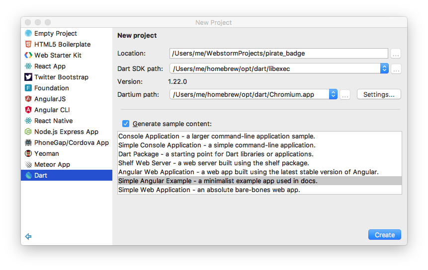
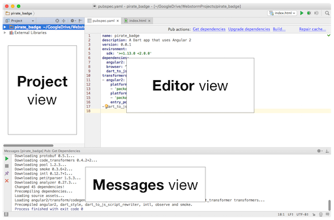
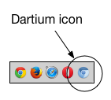
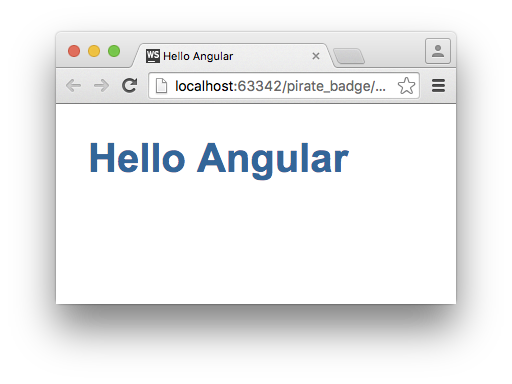

In this step, you create an Angular app, look at its code,
and run the app in Dartium.

<aside class="alert alert-success" markdown="1">
<i class="fa fa-lightbulb-o"> </i> **Tip**  
This code lab uses a 2-column format if your window is wide enough.
The left column contains instructions that assume you are using WebStorm.
The right column contains **Key information**&mdash;
concepts and background information.
Also in the right column,
the **Not using WebStorm?** sections include alternate instructions
for working from the command line.
</aside>

## <i class="fa fa-anchor"> </i> Create a simple Angular app.

WebStorm provides a set of templates
for creating a variety of Dart apps.
When you create a new app,
you can start with one of the application templates,
or you can start from scratch.

 

<ol>
<li markdown="1">Launch WebStorm. 
    
  If this is the first time you are running WebStorm, or if
  you have no open projects from a previous session,
  a "Welcome to WebStorm" screen appears.
</li>

<li markdown="1">If you haven't already,
set the paths for Dartium and the SDK.
You can find the instructions at
[Configuring Dart Support](/tools/webstorm#configuring-dart-support).
</li>

<li markdown="1">Choose **Create New Project** from the welcome screen,
or **File > New > Project...** from the menu.  A dialog appears.
</li>

<li markdown="1">Select **Dart** from the list on the left.
</li>

<li markdown="1">In the **Location** input field, check that
the project folder is where you want it.
</li>

<li markdown="1">Also in the **Location** field,
change the name of the project from `untitled` to `pirate_badge`.
</li>

<li markdown="1">Make sure that **Start Dartium in checked mode** is checked.
</li>

<li markdown="1">Make sure that **Generate sample content** is checked.
</li>

<li markdown="1">Select **Angular 2 Web Application** from the list.

The form should look similar to the following:

</li>

<li markdown="1">Click **Create**.
</li>
</ol>

WebStorm takes several seconds to analyze the sources and do other housekeeping.
This only happens once. After that, you'll be able to do the usual things, like
using **F1** to get help on any method, class or field, or **Command+B** to
navigate to a method's declaration, or **Shift+F6** to refactor or rename.

 

<i class="fa fa-key key-header"> </i> <strong> Key information </strong>

* WebStorm loads its Dart project templates from
  [Stagehand](http://stagehand.pub/), a Dart project generator.

<i class="fa fa-lightbulb-o key-header"> </i> <strong> Not using WebStorm? </strong>

<ol markdown="1">
<li markdown="1">Create a directory on your computer for the project.


mkdir pirate_badge


</li>
<li markdown="1">Copy the contents of the
    [one-hour-code-lab/ng2/1-skeleton](https://github.com/dart-lang/one-hour-codelab/archive/master.zip)
    directory into your new project's directory.
    Or, better yet, use `stagehand` to get the starting files:


cd pirate_badge
pub global activate stagehand
stagehand web-angular


</li>
</ol>

 

## <i class="fa fa-anchor"> </i> What happened?

 

WebStorm creates a `pirate_badge` directory and boilerplate files for
a basic Angular app. It then runs `pub get`, Dart's package management tool,
to download the packages that the app depends on. Finally, WebStorm runs
Dart's static analyzer over the code to look for errors and warnings.

 

<i class="fa fa-key key-header"> </i> <strong> Key information </strong>

<ol markdown="1">

<li markdown="1"> The **messages** view at the bottom of the screen
  reports the output from the pub commands.
</li>

<li markdown="1"> The **editor** view, on the right,
  opens with the contents of the `web/index.html` file.
</li>

<li markdown="1"> If the currently opened file passes analysis,
  a green checkmark 
  displays in the upper right corner of the editor view.
  If the code fails analysis, a yellow box
   displays.
  Hover over the tick marks (yellow for warnings or red for errors)
  along the right edge of the editor view for more information. 

  WebStorm might warn that `my-app` is an unknown HTML tag in
  `index.html`. **You can ignore this warning.**
</li>
</ol>

<i class="fa fa-lightbulb-o key-header"> </i> <strong> Not using WebStorm? </strong>

<ul markdown="1">

<li markdown="1">Within your project's directory,
  run [`pub get`](/tools/pub/)
  to download the packages that the app depends on.
  Pub is Dart's package management tool.
</li>

<li markdown="1"> You can run the analyzer on your code at
  the command line using the
  [dartanalyzer](https://github.com/dart-lang/analyzer_cli#dartanalyze://github.com/dart-lang/sdk/tree/master/pkg/analyzer_cli#dartanalyzer) command:


dartanalyzer .

</li>
</ul>

## <i class="fa fa-anchor"> </i> What did you get?

Get familiar with the structure of a basic Angular app.

 

In the **Project** view, on the left, expand the `pirate_badge` folder.
Then expand the `lib` and `web` folders to see the following:

 

<i class="fa fa-key key-header"> </i> <strong> Key information </strong>

* Angular is an application framework for web apps.

* In Angular, you display data by defining _components_, a type of class.

* A component manages a _view_, an HTML template that defines
  the component's UI.

* A component encapsulates the appearance and behavior of the view.

 

For now, you can ignore some of these auto-created files.
The following shows the files and directories referenced in
this code lab:


pirate_badge/
  lib/
    app_component.dart
    app_component.html
  web/
    index.html
    main.dart
  pubspec.yaml


As you might expect,
the `lib` directory contains library files. In an Angular app,
component classes are generally created as library files.
The `web` directory contains the main files for a web app.
Double clicking a file opens that file in the editor view.

 

## <i class="fa fa-anchor"> </i> Review the code. {#review-the-code}

Get familiar with the HTML and the Dart code for the skeleton
version of the app.
Double-click a filename in the project view to see its contents in the editor view.
Double click the ellipsis (`...`) highlighted in green to see the hidden text.
You should the following code (all copyright notices are omitted here):

### **main.dart**

 


import 'package:angular2/platform/browser.dart';

import 'package:pirate_badge/app_component.dart';

main() {
  bootstrap(AppComponent);
}


 

<i class="fa fa-key key-header"> </i> <strong> Key information </strong>

* The `main()` function is the single entry point for the app.

* `main()` is a top-level function.
  A top-level variable or function is one that is declared outside a
  class definition.

* The top lines import two libraries.

* The `package:` syntax specifies the location of the library.

* This app depends on the `angular2` package, which the pub tool
  downloads from [pub.dartlang.org](https://pub.dartlang.org/).
  Files that call `bootstrap()` import `platform/browser.dart` from the
  angular package.

* The second import, `app_component.dart`,
  loads the app component, `AppComponent`.
  The `package:pirate_badge/app_component.dart` text tells
  the pub tool to look for this file under the `lib`
  directory of this app.

* By convention,
  Dart filenames are lower_case_with_underscores,
  while Dart class names are CamelCase.
  So, the `app_component.dart` file defines the `AppComponent` class.

* Calling `bootstrap()` starts your app, with the specified component
  as the app's root component.

 

### **index.html**

 


<!DOCTYPE html>
<html>
  <head>
    <title>pirate_badge</title>

    
    
  </head>
  <body>
    <my-app>Loading...</my-app>
  </body>
</html>


 

<i class="fa fa-key key-header"> </i> <strong> Key information </strong>

* The first `<script>` tag identifies the main file that implements
  the app. Here, it's the `main.dart` file. The Dart VM launches
  the app using this file.

* The `packages/browser/dart.js` script checks for native Dart
  support (for example, Dartium) and either bootstraps the Dart VM
  or loads compiled JavaScript instead.

* When Angular detects the `<my-app>` selector, it loads an
  instance of the component associated with that selector.
  In this example, that's the `AppComponent` class.

### **app_component.dart**

 


import 'package:angular2/core.dart';

@Component(selector: 'my-app', templateUrl: 'app_component.html')
class AppComponent {}


 

<i class="fa fa-key key-header"> </i> <strong> Key information </strong>

* Importing `core.dart` lets the app use `Component` and other
  common Angular types.

* The `@Component` annotation defines `AppComponent` as an Angular
  component.

* The `@Component` constructor has two named parameters: `selector`
  and `templateUrl`.

* The `selector` parameter specifies a CSS selector for this component.
  Angular creates and displays an instance of `AppComponent` when it
  encounters a `<my-app>` element in the HTML.

* The `templateUrl` parameter specifies the file that contains the view.
  To define the HTML _within_ the Dart file as a Dart string,
  use the `template` parameter instead.

&nbsp;  non-breaking space required for bootstrap/markdown bogosity 

 

### **app_component.html**

 


<h1>My First Angular 2 App</h1>


 

<i class="fa fa-key key-header"> </i> <strong> Key information </strong>

* This simple component displays a title.

* This file is the template for the AppComponent class.
  This HTML is inserted whenever the `<my-app>` element
  appears in the app.

&nbsp;  non-breaking space required for bootstrap/markdown bogosity 

 

### **pubspec.yaml**

 


name: pirate_badge
description: A Dart app that uses Angular 2
version: 0.0.1
environment:
  sdk: '>=1.13.0 <2.0.0'
dependencies:
  angular2: 2.0.0-beta.17
  browser: ^0.10.0
  dart_to_js_script_rewriter: ^1.0.1
transformers:
- angular2:
    platform_directives:
    - 'package:angular2/common.dart#COMMON_DIRECTIVES'
    platform_pipes:
    - 'package:angular2/common.dart#COMMON_PIPES'
    entry_points: web/main.dart
- dart_to_js_script_rewriter


 

<i class="fa fa-key key-header"> </i> <strong> Key information </strong>

* The `pubspec.yaml` file (often referred to as the _pubspec_)
  contains metadata about that package, such as its name.

* The pubspec also lists the packages on which the
  app depends. The `angular2`, `browser`, and
  `dart_to_js_script_rewriter` packages needed by
  this app are hosted on [pub.dartlang.org](https://pub.dartlang.org/)
  along with many others.

* When pub serves, builds, or runs an app, it can run one or
  more transformers to prepare the app.
  Transformers are listed and configured in
  the pubspec under the `transformers:` field.

* The Angular 2 transformer generates static structures that
  remove the need for reflection at runtime, making your app
  run more efficiently.

* The `platform_directives` definition makes some common
  Angular directives available to every component.
  An example of a common Angular directive is NgIf,
  which lets a component change its UI based on a true-false value
  in your Dart code.

* The `platform_pipes` definition makes some common
  Angular pipes available to every component.
  For example, you can use the built-in PercentPipe to format
  a number as a percentage.

* The `entry_points` section tells the Angular transformer which file contains
  the starting point for the app. Some apps have multiple entry points.

* Pub uses the `dart_to_js_script_rewriter` transformer when building
  your app for deployment.

* Running `pub get` installs the packages that your app depends on,
  as defined by your app's pubspec.
  WebStorm typically detects that the pubspec has changed
  and asks you to get the dependencies again.
  If the buttons don't appear at the top of the editor view,
  you can find them by opening the pubspec.

* A `pubspec.lock` file, created by `pub get`, lists every package
  that your app directly or indirectly depends on,
  along with the version number for each package.

 

## <i class="fa fa-anchor"> </i> Run the sample app.

Run the app using Dartium.

 

In WebStorm,
double-click the web/index.html file to open the file in the editor view.
Hover your mouse pointer over the code to show the browser icons bar,
and click the Dartium icon on the far right.

WebStorm launches the app in a Dartium window.
You should see something like the following:

After you've run the app using the menu, WebStorm remembers.
In the future, you can launch the app using the enabled **Run** button
 in the upper right corner of the
WebStorm window.
(The run button in the messages view runs the last pub command again.)

<aside class="alert alert-success" markdown="1">
<i class="fa fa-lightbulb-o"> </i> **Tip**  
If this is your first time launching Dartium on OS X,
you might see a dialog from OS X's Gatekeeper stating
that **"Chromium.app" can't be opened
because it is from an unidentified developer.**
You can grant an exemption on a per-app basis.
For more information, see
[how to open an app from an unidentified developer](https://support.apple.com/en-us/HT202491)
on Apple's support website.

 
<i class="fa fa-lightbulb-o"> </i> **Tip**  
You might also see a dialog saying, **Chromium wants to use your
confidential information stored in "Chromium Safe Storage" in
your keychain.**
This dialog can occur on the Mac if you've ever saved passwords in Safari.
You can "Deny" the request and your app will still work. This
[blog post](http://www.idownloadblog.com/2013/03/04/google-chrome-wants-to-use-your-confidential-information-store-in-the-keychain/)
has information on how to permanently eliminate these warnings.
</aside>

 

<i class="fa fa-key key-header"> </i> <strong> Key information </strong>

* The app is referred to as Dartium,
  but the executable might be named Chromium or Chrome.

* When Dartium launches, it displays two warnings:
  "You are using an unsupported command-line flag..."
  and "Google API keys are missing..."
  You can ignore these.

<i class="fa fa-lightbulb-o key-header"> </i> <strong> Not using WebStorm? </strong>

<ul markdown="1">
<li markdown="1">You can use pub to build and serve your app,
  so you can run the app in any modern browser.

<ol markdown="1">

<li markdown="1">From the directory that contains the pubspec file,
  enter `pub serve`.  The output should include the following:


$ pub serve
Loading source assets...
Loading angular2 and dart_to_js_script_rewriter transformers... (2.6s)
[[highlight]]Serving pirate_badge web on http://localhost:8080[[/highlight]]
Build completed successfully
...


You can specify an alternate port if 8080 is not available.
For more information, see [pub serve](/tools/pub/pub-serve).
</li>

<li markdown="1">
In Dartium or any modern browser, navigate to:


http://localhost:8080


If you specified a different port when you started the server,
use that instead of 8080.
</li>

</ol>

</li>

</ul>

## Problems?

Look in WebStorm's window for possible errors.
If that fails, look in your browser's JavaScript console.
In Dartium or Chrome, bring up the console using
**View > Developer > JavaScript Console**.

Finally, if you still haven't found the problem
check your code against the files in
[1-skeleton](https://github.com/dart-lang/one-hour-codelab/tree/master/ng2/1-skeleton).

* [lib/app_component.dart](https://raw.githubusercontent.com/dart-lang/one-hour-codelab/master/ng2/1-skeleton/lib/app_component.dart)
* [lib/app_component.html](https://raw.githubusercontent.com/dart-lang/one-hour-codelab/master/ng2/1-skeleton/lib/app_component.html)
* [web/main.dart](https://raw.githubusercontent.com/dart-lang/one-hour-codelab/master/ng2/1-skeleton/web/main.dart)
* [web/index.html](https://raw.githubusercontent.com/dart-lang/one-hour-codelab/master/ng2/1-skeleton/web/index.html)
* [pubspec.yaml](https://raw.githubusercontent.com/dart-lang/one-hour-codelab/master/ng2/1-skeleton/pubspec.yaml)
