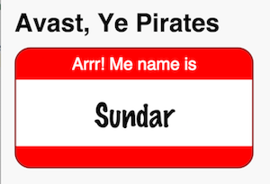

In this step, you extend the basic Angular app
with a badge component, which encapsulates
the behavior and appearance of the pirate badge.

This is the hardest step in this codelab.
By the end of this step, your app will display
a snazzy name badge. The next steps,
where you add interactivity, are easy and fun.

## <i class="fa fa-anchor"> </i> Add badge_component.html.

 

1. In WebStorm's Project view, right-click the `lib` directory and
   select **New > Directory** from the menu that pops up.

1. Enter `src` as the directory name and click **OK**.

1. In WebStorm's Project view, right-click the newly created `src` directory and
   select **New > File** from the menu that pops up.

1. Enter `badge_component.html` as the filename
   and click **OK**.

 

<i class="fa fa-key key-header"> </i> <strong> Key information </strong>

* WebStorm creates an empty `badge_component.html` file under `lib/src`.

* You can also create the file by selecting **New > HTML File** from
  the menu, and entering `badge_component` as the name, but the
  resulting file contains HTML required for a standalone page.
  You'll need to delete the code before proceeding.

&nbsp;  non-breaking space required for bootstrap/markdown bogosity 

 

## <i class="fa fa-anchor"> </i> Edit badge_component.html.

Enter the HTML for the name badge.

 


[[highlight]]
[[/highlight]]
  [[highlight]]
Arrr! Me name is
[[/highlight]]
  [[highlight]]
{{badgeName}}
[[/highlight]]
[[highlight]]
[[/highlight]]


<aside class="alert alert-success" markdown="1">
<i class="fa fa-lightbulb-o"> </i> **Tip**  
WebStorm defaults to 4 characters when indenting HTML code.
You can change it to the 2-character indentation used in Dart code files:

<ol markdown="1">
<li markdown="1">Bring up the **Preferences** dialog.
</li>
<li markdown="1">Select **Editor > Code Style > HTML**.
</li>
<li markdown="1">Enter `2` for **Tab size** and **Indent**, and `4` for
  **Continuation indent**.
</li>
</ol>
</aside>

 

<i class="fa fa-key key-header"> </i> <strong> Key information </strong>

* You've just defined a template for an Angular component.
  Angular templates use HTML but don't have all the tags that
  HTML pages do. For example, Angular templates don't have
  `<head>` or `<body>` tags.

* The `
` code defines areas of content that you can style.
  Later in this step, you add a style sheet (a CSS file) that defines how
  the badge should be displayed. This lab doesn't cover how to write CSS.
  The [resources](resources) page has information on where you
  can learn more about CSS styling.

* You will add `badgeName` to the Dart code as an instance variable
  in the next section.

* All instance variables defined in an Angular component are
  available to the template for that component.

* The curly bracket notation, `{{expression}}`,
  is sometimes called _double mustaches_. This notation creates a
  one-way binding between the HTML template and the Dart code.

* The expression inside the curly brackets
  is evaluated using _interpolation_, a process where
  Angular evaluates the expression and converts it to a string.

* Angular's expression interpolation is different from Dart's string
  interpolation.

* In a double-mustache binding, data is copied from an expression into the UI.
  So, when the value of `badgeName` changes in the Dart code,
  the value in the UI automatically updates.

## <i class="fa fa-anchor"> </i> Create a style sheet for the badge component.

 

Shiver me timbers!

The style sheet is too long to include here,
but we've provided one for you to copy and paste into your project.

1. In WebStorm's Project view, right click the `lib/src` directory,
  and select **New -> Stylesheet** from the menu that pops up.

1. Enter `badge_component` as the filename and click **OK**.

1. Paste the contents from
   [badge_component.css](https://raw.githubusercontent.com/dart-lang/one-hour-codelab/master/ng2/2-blankbadge/lib/src/badge_component.css)
  into the newly created file.

 

<i class="fa fa-key key-header"> </i> <strong> Key information </strong>

* WebStorm creates an empty `badge_component.css` file under `lib/src`.
  Note that the CSS extension is provided for you.

* Cascading Style Sheets (CSS) is a language used for describing
  the appearance of a document written in HTML, XHTML, or other
  markup languages.

* Each component should have a style sheet that describes the
  appearance for that component.

* Naming the CSS file with the same prefix used for the
  component is an Angular convention.

* We've provided a style sheet for you. The [resources](resources.html)
  section has information on where you can learn more about CSS
  styling.

* Next, you'll connect the style sheet to the component in the Dart
  code.

## <i class="fa fa-anchor"> </i> Add badge_component.dart.

 

1. In WebStorm's Project view,
   right-click the `lib/src` directory, and
   select **New > Dart File** from the menu that pops up.

1. Enter `badge_component` as the filename and click **OK**.

 


<i class="fa fa-key key-header"> </i> <strong> Key information </strong>

* x



&nbsp;  non-breaking space required for bootstrap/markdown bogosity 

 

## <i class="fa fa-anchor"> </i> Edit badge_component.dart.

Import Angular's main library.

 


[[highlight]]import 'package:angular2/angular2.dart';[[/highlight]]


Create a BadgeComponent class annotated with
`@Component`. The class contains a name badge
instance variable&mdash;replace "Sundar" with your name.


import 'package:angular2/angular2.dart';

[[highlight]]@Component([[/highlight]]
    [[highlight]]selector: 'pirate-badge',[[/highlight]]
    [[highlight]]templateUrl: 'badge_component.html',[[/highlight]]
    [[highlight]]styleUrls: const ['badge_component.css'])[[/highlight]]
[[highlight]]class BadgeComponent {[[/highlight]]
  [[highlight]]String badgeName = 'Sundar';[[/highlight]]
[[highlight]]}[[/highlight]]


 

<i class="fa fa-key key-header"> </i> <strong> Key information </strong>

* The pirate badge component manages the portion of the UI
  that displays the pirate badge. By the end of this codelab,
  the pirate badge component will also provide an input field for
  entering a name, and a button for generating a pirate name.

* Metadata gives additional information about code.
  In Dart, a _metadata annotation_ (usually just called an
  _annotation_) begins with the character `@`,
  followed by either a reference to a compile-time constant
  or a call to a constant constructor.

* The `styleUrls` parameter to the `Component` constructor
  specifies the file that contains the CSS styling for this component.

* The code `[<value>]` creates a list that contains a single value
  (in this case the name of the CSS file).

* The `const` modifier on the list literal,
  `const ['badge_component.css']`, converts the collection
  to a compile-time constant.
  Recall that `Component(...)` is a constant constructor,
  and all arguments to constant constructors must be compile-time
  constants.

&nbsp;  non-breaking space required for bootstrap/markdown bogosity 

 

## <i class="fa fa-anchor"> </i> Create app_component.html.

 

In the `lib` directory, create a file named `app_component.html`
and put the following contents in it:


[[highlight]]<h1>Avast, Ye Pirates</h1>[[/highlight]]
[[highlight]]<pirate-badge></pirate-badge>[[/highlight]]


 

<i class="fa fa-key key-header"> </i> <strong> Key information </strong>

* When Angular detects the `<pirate-badge>` selector, it loads an
  instance of `BadgeComponent`.

* Angular doesn't know about `app_component.html` yet. To associate this
  HTML file with the component, you need to edit the corresponding Dart file.

## <i class="fa fa-anchor"> </i> Edit app_component.dart.

Import the pirate badge component.

 


import 'package:angular2/angular2.dart';

[[highlight]]import 'src/badge_component.dart';[[/highlight]]


 

<i class="fa fa-key key-header"> </i> <strong> Key information </strong>

* A component imports the other components that it uses.

* By default, every Dart file is a separate library.

* When you have multiple Dart files under `lib`, they can import
  each other using relative paths, for example,
  `import 'src/badge_component.dart'`.
  However, any file that's not under `lib` (`web/main.dart`, for example)
  must use a `package:` URL to import libraries defined under `lib`.

* After you import the library, the analyzer warns that you
  have an unused import. This error will go away later, when you add
  the `BadgeComponent` directive.

 

Change the `template` parameter to `templateUrl`,
and point to the new HTML file.

 


@Component(selector: 'my-app',
    [[highlight]]templateUrl: 'app_component.html'[[/highlight]])


 

<i class="fa fa-key key-header"> </i> <strong> Key information </strong>

* Any components that this component directly uses
  are listed in the `directives:` field.

* When the app component is loaded, Angular detects the
  `<pirate-badge>` selector and loads the BadgeComponent class.

&nbsp;  non-breaking space required for bootstrap/markdown bogosity 

Add a directive to the `@Component` annotation.

 


@Component(selector: 'my-app',
    templateUrl: 'app_component.html'[[highlight]],[[/highlight]]
    [[highlight]]directives: const [BadgeComponent])[[/highlight]]


 

<i class="fa fa-key key-header"> </i> <strong> Key information </strong>

* Any components that this component directly uses
  are listed in the `directives:` field.

* When the app component is loaded, Angular detects the
  `<pirate-badge>` selector and loads the BadgeComponent class.

&nbsp;  non-breaking space required for bootstrap/markdown bogosity 

 

Format the file.

To format the file that is currently open,
right-click in the editor view and select
**Reformat with Dart Style** from the menu that pops up.
After formatting, the `@Component` annotation should look like this:


@Component(
    selector: 'my-app',
    templateUrl: 'app_component.html',
    directives: const [BadgeComponent])


 

<i class="fa fa-key key-header"> </i> <strong> Key information </strong>

* Well formatted code is (usually) more readable code.

* Don't worry about the formatter breaking your code.
  The formatter affects only white space.

<i class="fa fa-lightbulb-o key-header"> </i> <strong> Not using WebStorm? </strong>

* From the command line, format your code using the
  [dartfmt](https://github.com/dart-lang/dart_style#using-dartfmt) command.

&nbsp;  non-breaking space required for bootstrap/markdown bogosity 

 

## <i class="fa fa-anchor"> </i> Edit the app's style sheet.

Edit `web/styles.css`, replacing all of its contents with the following:


body {
    background-color: #F8F8F8;
    font-family: 'Open Sans', sans-serif;
    font-size: 14px;
    font-weight: normal;
    line-height: 1.2em;
    margin: 15px;
}


## <i class="fa fa-anchor"> </i> Edit index.html.

Edit `web/index.html`, changing the title to something more descriptive than "Hello Angular".

 


<title>[[highlight]]Avast, Ye Pirates[[/highlight]]</title>


 


<i class="fa fa-key key-header"> </i> <strong> Key information </strong>


## <i class="fa fa-anchor"> </i> Test it!

Click  to run the app.
You should see a name badge with your name,
or "Sundar" if you didn't change the name.
Assuming your machine has the fonts specified in the CSS file,
the badge should look similar to the following:

Next you will add some interactivity.

## Problems?

Look in WebStorm's window for possible errors.
If that fails, look in your browser's JavaScript console.
In Dartium or Chrome, bring up the console using
**View > Developer > JavaScript Console**.


update-for-dart-2


Finally, if you still haven't found the problem
check your code against the files in
[2-blankbadge](https://github.com/dart-lang/one-hour-codelab/tree/master/ng2/2-blankbadge).

* [lib/app_component.dart](https://raw.githubusercontent.com/dart-lang/one-hour-codelab/master/ng2/2-blankbadge/lib/app_component.dart)
* [lib/app_component.html](https://raw.githubusercontent.com/dart-lang/one-hour-codelab/master/ng2/2-blankbadge/lib/app_component.html)
* [lib/src/badge_component.dart](https://raw.githubusercontent.com/dart-lang/one-hour-codelab/master/ng2/2-blankbadge/lib/src/badge_component.dart)
* [lib/src/badge_component.html](https://raw.githubusercontent.com/dart-lang/one-hour-codelab/master/ng2/2-blankbadge/lib/src/badge_component.html)
* [lib/src/badge_component.css](https://raw.githubusercontent.com/dart-lang/one-hour-codelab/master/ng2/2-blankbadge/lib/src/badge_component.css)
* [web/index.html](https://raw.githubusercontent.com/dart-lang/one-hour-codelab/master/ng2/2-blankbadge/web/index.html)
* [web/styles.css](https://raw.githubusercontent.com/dart-lang/one-hour-codelab/master/ng2/2-blankbadge/web/styles.css)
