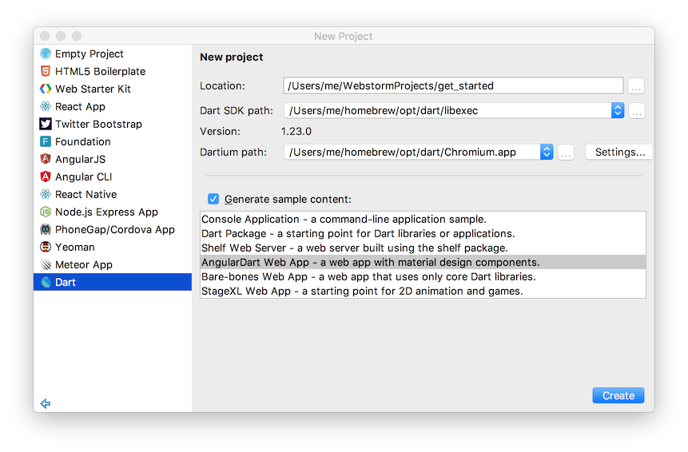
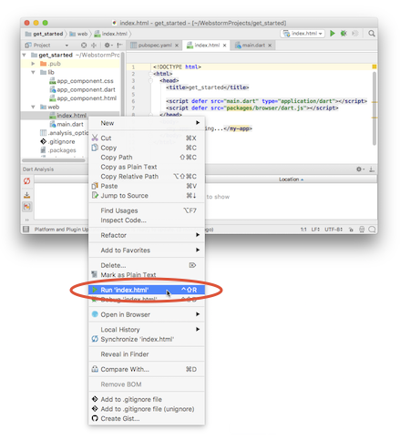
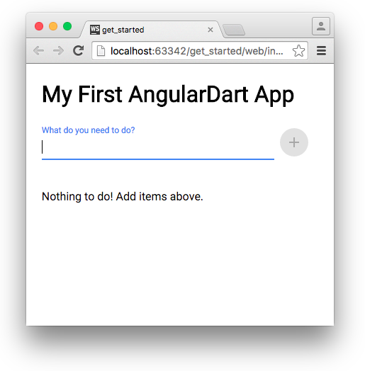
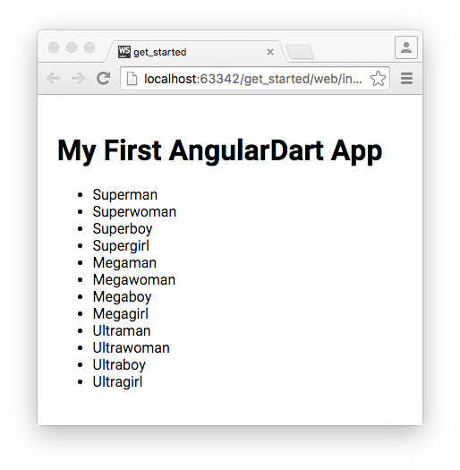

Follow these steps to start using Dart to develop web apps.
First you'll play with Dart in your browser, no download required.
Then you'll install Dart and build a small app
that uses the [AngularDart][] framework and [AngularDart Components][].

[AngularDart]: /angular
[AngularDart Components]: /components

## 1. Play with DartPad

With DartPad you can experiment with the Dart language and APIs,
no download necessary.

For example, here's an embedded DartPad that lets you play with
the code for a todo-list generator.
Click run (  ) to run the app.
You can also edit the source code—perhaps you'd like to add "horse"
to the list of pets. To get the full DartPad experience,
<a href="https://dartpad.dartlang.org/9ab0406003c8ba8c727861c9468ba158"
   target="_blank">open the example at dartpad.dartlang.org</a>.

<iframe
    src="{{site.custom.dartpad.embed-inline-prefix}}?id=9ab0406003c8ba8c727861c9468ba158&verticalRatio=70"
    width="100%"
    height="450px"
    style="border: 1px solid #ccc;">
</iframe>

More information:

* [DartPad documentation]({{site.dartlang}}/tools/dartpad)
* [Dart language tour]({{site.dartlang}}/guides/language/language-tour)
* [Dart library tour]({{site.dartlang}}/guides/libraries/library-tour)

## 2. Install Dart

Once you're ready to move beyond DartPad and develop real apps,
you need the Dart SDK and Dartium (a special build of Chromium with the Dart VM).


update-for-dart-2.0


As you install, **note the paths to the SDK and Dartium.**
You'll need them in step 4.

<ul class="tabs__top-bar">
    <li class="tab-link current" data-tab="tab-sdk-install-windows">Windows</li>
    <li class="tab-link" data-tab="tab-sdk-install-linux">Linux</li>
    <li class="tab-link" data-tab="tab-sdk-install-mac">Mac</li>
</ul>

The easiest way to install Dart on Windows is to use the
<a href="http://www.gekorm.com/dart-windows/" target="_blank">community install wizard.</a>

 

You can use Aptitude to install the Dart SDK on Linux.

First, perform the following one-time setup:


sudo apt-get update
sudo apt-get install apt-transport-https
sudo sh -c 'curl https://dl-ssl.google.com/linux/linux_signing_key.pub | apt-key add -'
sudo sh -c 'curl https://storage.googleapis.com/download.dartlang.org/linux/debian/dart_stable.list > /etc/apt/sources.list.d/dart_stable.list'


Then install the Dart SDK:


sudo apt-get update
sudo apt-get install dart


Finally, [download Dartium.](https://storage.googleapis.com/dart-archive/channels/stable/release/latest/dartium/dartium-linux-x64-release.zip)

With [Homebrew](http://brew.sh/),
installing Dart is easy.


brew tap dart-lang/dart
brew install dart --with-content-shell --with-dartium


More information:
[installing and updating Dart]({{site.dartlang}}/install)

## 3. Get WebStorm

Although using an IDE is optional, we highly recommend WebStorm.
WebStorm comes with Dart support,
making it easy to write correct Dart code and to run it
in Dartium or any other browser.

<a href="http://www.jetbrains.com/webstorm/download/">Download and install WebStorm.</a>

More information: [Dart tools for the web](/tools)

## 4. Create a web app

We recommend using Angular for your Dart web apps,
but you have [other options](/guides/web-programming) as well.
Here's how to use WebStorm to create a web app that uses AngularDart:

1. Choose **Create New Project** from WebStorm's welcome screen,
   or **File > New > Project...** from the menu.  A dialog appears.
1. Choose **Dart** from the list on the left.
1. If the **Dart SDK path** and **Dartium path** fields don't have values, enter them.
1. Edit the **Location** field to set the app location and name.
1. Select **Generate sample content** to show the list of templates.
1. Choose the **AngularDart Web App** template.
1. Click **Create**. 

More information:

* [Installing and using WebStorm](/tools/webstorm)
* [Setup for AngularDart development](/angular/guide/setup)

## 5. Run the app

To run the app from WebStorm, right-click the app's `web/index.html` file and choose
**Run 'index.html'**.



You should see a simple todo list manager. Try it out!

## 6. Add custom code to the app

Let's customize the app you just created.

<ol markdown="1">
<li markdown="1">
  Copy the `thingsTodo()` function from the DartPad above
  to the bottom of the `lib/todo_list/todo_list_service.dart` file.
</li>

<li markdown="1">
  Still in `todo_list_service.dart`, initialize the `mockTodoList` field using
  `thingsTodo()`:


class TodoListService {
  [[highlight]]List<String> mockTodoList = thingsTodo().toList();[[/highlight]]
  ...
}

[[highlight]]Iterable<String> thingsTodo() sync* { ... }[[/highlight]]

</li>

<li markdown="1">
  Run the app. Now the initial todo list has things to do!
  After you feed the cats, your todo list should look like this:

  
</li>
</ol>

<aside class="alert alert-info" markdown="1">
**Feeling lost? Don't worry!**
This was a whirlwind introduction to Dart and Angular
that left out many details.
For a gentler approach, try the codelab
[Avast, Ye Pirates: Write an AngularDart App.](/codelabs/ng2/)
</aside>

## What next?

[Learn more about AngularDart.](/angular)

Or check out these resources:

* Web-related tutorials and codelabs for Dart
  * [Tutorials](/tutorials)
  * [Codelabs](/codelabs)
* Dart language, libraries, and conventions
  * [Sample Code]({{site.dartlang}}/samples)
  * [Language Tour]({{site.dartlang}}/guides/language/language-tour)
  * [Library Tour]({{site.dartlang}}/guides/libraries/library-tour)
  * [Effective Dart]({{site.dartlang}}/guides/language/effective-dart)
* Tools & libraries
  * [Dart SDK]({{site.dartlang}}/tools/sdk)
  * [Dartium](/tools/dartium)
  * [Dart Tools for the Web](/tools)
  * [IDEs]({{site.dartlang}}/tools#ides)
  * [Web Libraries](/guides/web-programming)

If you get stuck, find help at [Community and Support.](/community)
